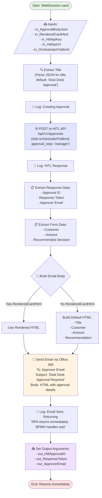

# WaitDecision Workflow Diagram

## Overview

This UiPath workflow creates a Deal Desk approval request, sends an email notification, and returns immediately. The BPMN orchestration layer handles waiting for the approver's decision.

## Workflow Diagram

## Process Steps

### 1. Input Processing

Receives the following inputs:

- **in_ApprovalBodyJson**: JSON containing approval details (title, customer, amount, recommendation)
- **in_RenderedCardHtml**: Pre-rendered HTML email body (optional)
- **in_HitlApiKey**: API key for HITL service authentication
- **in_HitlApiUrl**: Base URL for HITL API endpoint
- **in_OrchestratorFolderId**: UiPath Orchestrator folder identifier

### 2. Title Extraction

Parses the approval body JSON to extract the title field. Falls back to "Deal Desk Approval" if parsing fails.

### 3. HITL API Call

POSTs to the Human-in-the-Loop API (`/api/v1/approvals`) with:

- Approval body data
- Orchestrator folder ID
- Default approval step: "manager"
- Default process key: "DealDeskApproval"

### 4. Response Data Extraction

Parses the HITL API response to extract:

- **Approval ID**: Unique identifier for this approval
- **Response Token**: Token used by the approver to submit their decision
- **Approver Email**: Email address of the assigned approver

### 5. Form Data Parsing

Extracts business data from the approval body:

- Customer name
- Deal amount
- Recommended decision

### 6. Email Body Composition

Builds the email body using one of two approaches:

- **Option A**: Use the pre-rendered HTML from `in_RenderedCardHtml` if provided
- **Option B**: Generate a default HTML email with approval details

### 7. Email Notification

Sends an email via Microsoft Office 365:

- **To**: Approver email address
- **Subject**: "Deal Desk Approval Required: [Title]"
- **Body**: HTML-formatted approval details with action buttons

### 8. Output & Return

Sets three output arguments and returns immediately:

- **out_HitlApprovalId**: For tracking the approval in external systems
- **out_ResponseToken**: For the approver to submit their decision
- **out_ApproverEmail**: For audit and notification purposes

## Key Design Principles

### Fire-and-Forget Pattern

This workflow follows a **non-blocking pattern**:

- Creates the approval record
- Sends the notification email
- Returns immediately without waiting

The BPMN orchestration layer is responsible for:

- Waiting for the approver's decision
- Handling timeouts and escalations
- Processing the approval response

### Error Handling

- Title extraction uses try-catch with a default fallback
- HITL API call validates response status and throws exceptions on failure
- All key operations are logged for troubleshooting

### Integration Points

- **HITL API**: External approval management system
- **Office 365**: Email delivery via UiPath Office 365 activities
- **UiPath Orchestrator**: Context tracking via folder ID
- **BPMN**: Upstream orchestration handles wait logic

## Dependencies

- UiPath.MicrosoftOffice365.Activities (v3.5.0-preview)
- UiPath.System.Activities (v26.2.6)
- Newtonsoft.Json for JSON parsing
| col1 | col2 | col3 |
| ---- | ---- | ---- |
|      |      |      |
|      |      |      |

# WaitDecision Workflow Diagram

## Overview

This UiPath workflow creates a Deal Desk approval request, sends an email notification, and returns immediately. The BPMN orchestration layer handles waiting for the approver's decision.

## Workflow Diagram

## Process Steps

### 1. Input Processing

Receives the following inputs:

- **in_ApprovalBodyJson**: JSON containing approval details (title, customer, amount, recommendation)
- **in_RenderedCardHtml**: Pre-rendered HTML email body (optional)
- **in_HitlApiKey**: API key for HITL service authentication
- **in_HitlApiUrl**: Base URL for HITL API endpoint
- **in_OrchestratorFolderId**: UiPath Orchestrator folder identifier

### 2. Title Extraction

Parses the approval body JSON to extract the title field. Falls back to "Deal Desk Approval" if parsing fails.

### 3. HITL API Call

POSTs to the Human-in-the-Loop API (`/api/v1/approvals`) with:

- Approval body data
- Orchestrator folder ID
- Default approval step: "manager"
- Default process key: "DealDeskApproval"

### 4. Response Data Extraction

Parses the HITL API response to extract:

- **Approval ID**: Unique identifier for this approval
- **Response Token**: Token used by the approver to submit their decision
- **Approver Email**: Email address of the assigned approver

### 5. Form Data Parsing

Extracts business data from the approval body:

- Customer name
- Deal amount
- Recommended decision

### 6. Email Body Composition

Builds the email body using one of two approaches:

- **Option A**: Use the pre-rendered HTML from `in_RenderedCardHtml` if provided
- **Option B**: Generate a default HTML email with approval details

### 7. Email Notification

Sends an email via Microsoft Office 365:

- **To**: Approver email address
- **Subject**: "Deal Desk Approval Required: [Title]"
- **Body**: HTML-formatted approval details with action buttons

### 8. Output & Return

Sets three output arguments and returns immediately:

- **out_HitlApprovalId**: For tracking the approval in external systems
- **out_ResponseToken**: For the approver to submit their decision
- **out_ApproverEmail**: For audit and notification purposes

## Key Design Principles

### Fire-and-Forget Pattern

This workflow follows a **non-blocking pattern**:

- Creates the approval record
- Sends the notification email
- Returns immediately without waiting

The BPMN orchestration layer is responsible for:

- Waiting for the approver's decision
- Handling timeouts and escalations
- Processing the approval response

### Error Handling

- Title extraction uses try-catch with a default fallback
- HITL API call validates response status and throws exceptions on failure
- All key operations are logged for troubleshooting

### Integration Points

- **HITL API**: External approval management system
- **Office 365**: Email delivery via UiPath Office 365 activities
- **UiPath Orchestrator**: Context tracking via folder ID
- **BPMN**: Upstream orchestration handles wait logic

## Dependencies

- UiPath.MicrosoftOffice365.Activities (v3.5.0-preview)
- UiPath.System.Activities (v26.2.6)
- Newtonsoft.Json for JSON parsing
# WaitDecision Workflow Diagram

## Overview
This UiPath workflow creates a Deal Desk approval request, sends an email notification, and returns immediately. The BPMN orchestration layer handles waiting for the approver's decision.

## Workflow Diagram

## Process Steps

### 1. Input Processing
Receives the following inputs:
- **in_ApprovalBodyJson**: JSON containing approval details (title, customer, amount, recommendation)
- **in_RenderedCardHtml**: Pre-rendered HTML email body (optional)
- **in_HitlApiKey**: API key for HITL service authentication
- **in_HitlApiUrl**: Base URL for HITL API endpoint
- **in_OrchestratorFolderId**: UiPath Orchestrator folder identifier

### 2. Title Extraction
Parses the approval body JSON to extract the title field. Falls back to "Deal Desk Approval" if parsing fails.

### 3. HITL API Call
POSTs to the Human-in-the-Loop API (`/api/v1/approvals`) with:
- Approval body data
- Orchestrator folder ID
- Default approval step: "manager"
- Default process key: "DealDeskApproval"

### 4. Response Data Extraction
Parses the HITL API response to extract:
- **Approval ID**: Unique identifier for this approval
- **Response Token**: Token used by the approver to submit their decision
- **Approver Email**: Email address of the assigned approver

### 5. Form Data Parsing
Extracts business data from the approval body:
- Customer name
- Deal amount
- Recommended decision

### 6. Email Body Composition
Builds the email body using one of two approaches:
- **Option A**: Use the pre-rendered HTML from `in_RenderedCardHtml` if provided
- **Option B**: Generate a default HTML email with approval details

### 7. Email Notification
Sends an email via Microsoft Office 365:
- **To**: Approver email address
- **Subject**: "Deal Desk Approval Required: [Title]"
- **Body**: HTML-formatted approval details with action buttons

### 8. Output & Return
Sets three output arguments and returns immediately:
- **out_HitlApprovalId**: For tracking the approval in external systems
- **out_ResponseToken**: For the approver to submit their decision
- **out_ApproverEmail**: For audit and notification purposes

## Key Design Principles

### Fire-and-Forget Pattern
This workflow follows a **non-blocking pattern**:
- Creates the approval record
- Sends the notification email
- Returns immediately without waiting

The BPMN orchestration layer is responsible for:
- Waiting for the approver's decision
- Handling timeouts and escalations
- Processing the approval response

### Error Handling
- Title extraction uses try-catch with a default fallback
- HITL API call validates response status and throws exceptions on failure
- All key operations are logged for troubleshooting

### Integration Points
- **HITL API**: External approval management system
- **Office 365**: Email delivery via UiPath Office 365 activities
- **UiPath Orchestrator**: Context tracking via folder ID
- **BPMN**: Upstream orchestration handles wait logic

## Dependencies
- UiPath.MicrosoftOffice365.Activities (v3.5.0-preview)
- UiPath.System.Activities (v26.2.6)
- Newtonsoft.Json for JSON parsing
