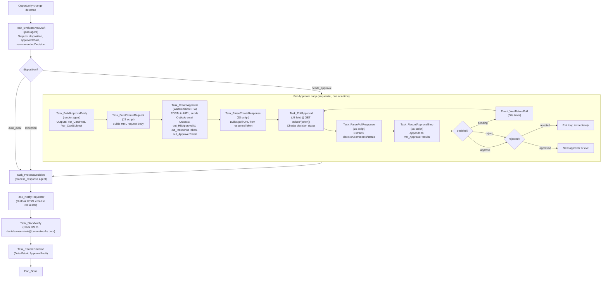

# DealDesk Approval Solution Blueprint

**Single source of truth** — June 21, 2026.
All prior docs (`DEALDESK_FLOW.md`, `DEPLOYMENT_RUNBOOK.md`, `PUBLISH_AND_TENANT_NOTES.md`,
`E2E_FINAL_STATUS.md`, `E2E_COMPLETION_SUMMARY.md`, `PROGRESS_SUMMARY.md`,
`DEPLOYMENT_BLOCKER_ANALYSIS.md`, `DEPLOY_NOW.md`, `CLI_BUG_AND_WORKAROUND.md`) are deleted.
This file supersedes all of them.

---

## 1. What this solution does

The DealDesk Approval solution evaluates a sales opportunity (discount %, deal value, deal type),
routes it through a configurable approval chain, and records a final outcome. The full flow:

1. A trigger (Salesforce event, API call, or manual start) submits a deal opportunity as JSON.
2. Optional demo enrichment can use the AgentHub `Salesforce DealDesk MCP` sidecar to fetch live Salesforce Opportunity/Account context before approval planning.
3. The `plan` agent evaluates the opportunity, determines disposition (`needs_approval`, `auto_clear`, `exception`), and returns an ordered approver chain.
4. For `needs_approval`, the BPMN loops sequentially through each manager in the chain.
5. Per approver step: the `render` agent generates the approval card HTML; the `WaitDecision` RPA robot posts to the AWS HITL service and sends the approver an Outlook HTML email with a portal link; the BPMN then polls the HITL service every 30 seconds until the approver decides.
6. A rejection at any step short-circuits the remaining chain immediately.
7. The `process_response` agent evaluates the collected decisions and determines the final outcome.
8. The requester receives an Outlook summary email with the full ordered approval trail.
9. A Slack DM is sent to `daniela.rosenstein@catonetworks.com` with the decision summary.
10. The final audit record is written to Data Fabric (`ApprovalAudit`).

---

## 2. Component map

| Component | Type | Source path | Orchestrator key | Version |
|---|---|---|---|---|
| `DealDeskApproval` | BPMN orchestration | `DealDeskSolution/DealDeskApproval/DealDeskApproval.bpmn` | `3533F569-7B5B-49A6-B0B9-087277D5D712` | 1.1.9 |
| `DealDeskApproval_WaitDecision` | RPA (UiPath Robot) | `DealDeskSolution/DealDeskApproval_WaitDecision/WaitDecision.xaml` | `0932CB58-FC8A-4287-AB2C-410E85075EBC` | 1.1.2 |
| `DealDeskAgent_plan` | AI Agent | `agent/nodes/plan_nodes.py` | `761D42AC-BEDD-4256-885F-E3C650C64018` | 0.1.17 |
| `DealDeskAgent_render` | AI Agent | `agent/nodes/render_nodes.py` | `1C12455E-6E5A-4DE3-81FE-55654BA1D2E8` | 0.1.17 |
| `DealDeskAgent_process_response` | AI Agent | `agent/nodes/process_response_nodes.py` | `99558773-C1CB-4F4B-994F-8DBB2EB242FD` | 0.1.17 |
| AWS HITL bridge | External service | `https://djun97l419cdy.cloudfront.net` | n/a | n/a |
| Salesforce DealDesk MCP | AgentHub MCP server | `out/salesforce-mcp/*.json` | `25641346-5f8a-46cf-91e3-6e862bd70cfb` | 1.0.0 |
| Outlook connection | Integration Service | n/a | `45b3022f-96ef-4ca4-99bb-39f15af717d5` | n/a |
| Salesforce connection | Integration Service | n/a | `1a1aaec6-6cc5-4969-bd92-0601146717f7` | n/a |
| Data Fabric connection | Integration Service | n/a | `58ec2518-2165-44ff-9646-5170f811a42d` | n/a |
| Data Fabric `ApprovalAudit` | Storage | UiPath Data Fabric | n/a | n/a |

**Agent package name**: `adaptive-approval-agent-core`

---

## 3. Canonical identifiers

| Property | Value |
|---|---|
| Cloud platform | `cloud.uipath.com` |
| Organization | `catonetworks` (id: `7787691a-2443-4089-9d9d-09f6ee857a0f`) |
| Tenant | `Test` (id: `20bf226d-f42c-4668-9cad-1c86ed398cf0`) |
| Folder name | `Shared/DealDeskApprovalGlobal` |
| Folder key | `5fc9fcc4-7156-40c2-9930-7ce61dbbf78b` |
| Folder id | `485092` |
| HITL base URL | `https://djun97l419cdy.cloudfront.net` |
| HITL approvals endpoint | `https://djun97l419cdy.cloudfront.net/api/v1/approvals` |
| HITL API key | stored in `.env` (`HITL_API_KEY`); default test key `hitl_test_api_key_12345` |
| Deployment name | `DealDeskApprovalGlobal` |
| Salesforce MCP slug | `salesforce-dealdesk-mcp` |
| Salesforce MCP server key | `25641346-5f8a-46cf-91e3-6e862bd70cfb` |
| Salesforce MCP URL | `https://cloud.uipath.com/7787691a-2443-4089-9d9d-09f6ee857a0f/Test/agenthub_/mcp/5fc9fcc4-7156-40c2-9930-7ce61dbbf78b/salesforce-dealdesk-mcp` |
| Salesforce IS connection ID | `1a1aaec6-6cc5-4969-bd92-0601146717f7` |
| Salesforce IS connection source folder | `OE02_POProcessing` |
| Outlook IS connection ID | `45b3022f-96ef-4ca4-99bb-39f15af717d5` |
| Data Fabric IS connection ID | `58ec2518-2165-44ff-9646-5170f811a42d` |

> **Note**: The folder `DealDesk` (key `5f93aec0-a43b-4281-9fa4-0b695b23effe`) does **not** exist in the
> `catonetworks/Test` tenant. Do not use that key. Use `5fc9fcc4-7156-40c2-9930-7ce61dbbf78b`.

---

## 4. Runtime flow (detailed)



### Loop control
- Sequential only (`isSequential="true"`) — one approver at a time.
- Rejection short-circuits via `completionCondition` on `Var_Decision`.
- No HTTP polling and no parallel branch in the approval loop.
- Timer is 30 seconds; first poll is immediate after RPA returns.

### WaitDecision RPA contract

The robot (v1.1.2) is a **fast-return** process. It does NOT use `UiPath.Persistence.Activities`.

**Inputs**:
| Argument | Type | Description |
|---|---|---|
| `in_ApprovalBodyJson` | string | Full HITL request body JSON (built by BPMN) |
| `in_RenderedCardHtml` | string | HTML email body from render agent |
| `in_HitlApiKey` | string | API key for HITL service |
| `in_HitlApiUrl` | string | Base URL for HITL service |
| `in_HitlCreateResponseJson` | string | Pre-supplied response (for debug/test bypass) |
| `in_OrchestratorFolderId` | int | Orchestrator folder numeric id (`485092`) |

**Outputs**:
| Argument | Type | Description |
|---|---|---|
| `out_HitlApprovalId` | string | HITL approval id (UUID) |
| `out_ResponseToken` | string | Token used by BPMN to poll for decision |
| `out_ApproverEmail` | string | Approver email address |

**What it does** (sequentially, ~5-10 seconds total):
1. Normalizes and validates `in_ApprovalBodyJson`.
2. POSTs to `{in_HitlApiUrl}/api/v1/approvals` with `x-api-key` header.
3. Extracts `approvalId` and `approvalLines[0].responseToken` from the 201 response.
4. Composes an Outlook HTML email with a portal link (not an adaptive card) and sends it to the approver.
5. Returns the three outputs. The BPMN then polls until a decision is made.

### AWS HITL API contract

| Endpoint | Auth | Used by |
|---|---|---|
| `POST /api/v1/approvals` | `x-api-key` | WaitDecision RPA |
| `GET /api/v1/approvals/token/{token}` | `x-api-key` | BPMN `Task_PollApproval` |
| `POST /api/v1/approvals/token/{token}/respond` | none (token-based) | Approver via email link |

**Rules**:
- Every `formData` key must be declared in `formSchema`. Extra keys return 400.
- Do not send `orchestrator_job_key` as an empty string — omit the field if empty (backend returns 500).
- Decision values: `approve` or `reject` (not `approved`/`rejected`).

### Results contract

`Var_ApprovalResults` is a JSON array. Each step appends:
```json
{
  "approverEmail": "...",
  "approverName": "...",
  "approverRole": "manager|director|vp_sales|cfo|cro",
  "approvalStatus": "approve|reject|escalate",
  "decision": "approve|reject|escalate",
  "comments": "...",
  "approvalId": "...",
  "approverIndex": 0,
  "decidedAt": "..."
}
```

The same payload is written to `ApprovalAudit.approvalTrail` (JSON stringified).

### Salesforce MCP sidecar

The hack/demo tenant now includes an AgentHub-hosted UiPath MCP server named
`Salesforce DealDesk MCP` in `Shared/DealDeskApprovalGlobal`. It wraps the enabled
Salesforce Integration Service connection `uipath_cato_robot_prod@catonetworks.com.full`
from `OE02_POProcessing` and exposes only read-oriented tools:

- `get-salesforce-opportunity` (`McpName`: `getSalesforceOpportunity`) retrieves an Opportunity by Salesforce record ID.
- `get-salesforce-account` (`McpName`: `getSalesforceAccount`) retrieves an Account by Salesforce record ID.
- `search-salesforce-soql` (`McpName`: `searchSalesforceSoql`) runs a bounded read-only SOQL `SELECT` query.

Do not add create/update/delete Salesforce MCP tools for the hack demo. The tool payloads live in
`out/salesforce-mcp/` and were created via `uip agenthub mcp-tools create-is-activity`.
A read-only smoke test against the same Salesforce connection succeeded with:

```powershell
uip is resources run create uipath-salesforce-sfdc curated_soqlQuery `
  --connection-id 1a1aaec6-6cc5-4969-bd92-0601146717f7 `
  --body '{"query":"SELECT Id, Name FROM Opportunity LIMIT 1"}' `
  --output json
```

---

## 5. Approval chain (HiBob mock)

No live HiBob API is used. Management chain is mocked from `agent/config/hibob_org.json`.
Resolver: `agent/integrations/manager_resolver.py`
Policy: `agent/nodes/plan_nodes.py`

Chain order (lowest to highest): `manager → director → vp_sales → cfo → cro`
- Deals above $750k also include `cro`.
- Rejection at any level short-circuits the remaining chain.

---

## 6. Solution manifest (Gap G)

`DealDeskSolution.uipx` currently registers **two** projects:
- `DealDeskApproval` (type: ProcessOrchestration) — id `4f04eb81-7e0f-49a9-b68c-7e6cbe2af3d4`
- `DealDeskApproval_WaitDecision` (type: Process) — id `ebd81e9d-5a42-4caa-ac76-4cc3ff40f79b`

`DealDeskHitlApi` is **not** registered in the manifest. Best practice is to register all
solution projects. If `DealDeskHitlApi` is still needed, add it:
```powershell
cd adaptive-approval-agent\DealDeskSolution
uip solution project add --project-path "DealDeskHitlApi" --output json
uip solution resource refresh --output json
```
If `DealDeskHitlApi` is retired (HITL is handled by the external AWS service), remove it from
the codebase to avoid confusion. The HITL proxy in this solution is the AWS CloudFront bridge,
not a separate UiPath API project.

---

## 7. Deployment procedure (working path)

> `uip solution publish` / `uip solution deploy run` are **broken** for this solution (the
> agent nupkg is not embedded correctly during pack, causing the publish step to fail with
> "No root solution folder"). The workaround below is the working path.

### 7.1 Pre-flight

```powershell
cd adaptive-approval-agent

# Confirm auth
uip login status --output json
# Must show: Organization: catonetworks, Tenant: Test

# Confirm target folder exists
uip or folders list --output json | Select-String "5fc9fcc4|DealDeskApprovalGlobal"
```

### 7.2 Refresh resources and validate

```powershell
cd adaptive-approval-agent

uip solution resource refresh --solution-folder DealDeskSolution --output json
uip solution project list --solution-folder DealDeskSolution --output json
# Must show DealDeskApproval (ProcessOrchestration) and DealDeskApproval_WaitDecision (Process)

python -m pytest tests/unit/test_dealdesk_runtime_contracts.py tests/unit/test_plan/test_disposition.py -q
# Must show: all passed

# Validate BPMN XML
python -c "import xml.etree.ElementTree as ET; ET.parse('DealDeskSolution/DealDeskApproval/DealDeskApproval.bpmn'); print('BPMN XML valid')"
```

### 7.3 Pack the solution

Always use a new version to avoid duplicate-version rejections:
```powershell
$version = "1.1.<next>"    # e.g. 1.1.10
uip solution pack "adaptive-approval-agent\DealDeskSolution" "adaptive-approval-agent\dist" --version $version --output json
# Output: dist/DealDeskSolution_$version.zip
```

### 7.4 Extract and upload the BPMN nupkg

```powershell
# Extract the BPMN package from the solution zip
Expand-Archive "adaptive-approval-agent\dist\DealDeskSolution_$version.zip" -DestinationPath "adaptive-approval-agent\dist\extracted_$version" -Force

# Find the BPMN nupkg inside the extracted zip
Get-ChildItem "adaptive-approval-agent\dist\extracted_$version" -Recurse -Filter "*.nupkg"
# Typically: files\<guid>\DealDeskApproval\content\<packagename>.nupkg

# Upload to the tenant feed (no --folder flag — tenant feed, not folder feed)
uip or packages upload "<path-to-bpmn.nupkg>" --output json
# Returns: packageId, version
```

### 7.5 Update the BPMN process version

```powershell
# If the process exists — update its version
uip or processes update-version 3533F569-7B5B-49A6-B0B9-087277D5D712 --package-version $version --folder-key 5fc9fcc4-7156-40c2-9930-7ce61dbbf78b --output json

# If the process was deleted/recreated — create a new one
uip or processes create --package-key "DealDeskSolution.agentic.DealDeskApproval" --package-version $version --folder-key 5fc9fcc4-7156-40c2-9930-7ce61dbbf78b --process-name DealDeskApproval --output json
# Record the new process Key — update BPMN bindings and this doc if it changes
```

### 7.6 Upload WaitDecision RPA (if changed)

WaitDecision is packed and uploaded the same way — either via `uip solution pack` extract or
via Studio Desktop publish:
```powershell
# Upload the WaitDecision nupkg to the tenant feed
uip or packages upload "<path-to-WaitDecision.nupkg>" --output json

# Update or recreate the process (if the key changed, update bindings_v2.json and the BPMN)
uip or processes update-version 0932CB58-FC8A-4287-AB2C-410E85075EBC --package-version <v> --folder-key 5fc9fcc4-7156-40c2-9930-7ce61dbbf78b --output json
```

### 7.7 Upload agent packages (if changed)

Agent processes all share the `adaptive-approval-agent-core` package:
```powershell
cd adaptive-approval-agent\agent
uip agents publish --output json
# Or: uip or packages upload "<path>\adaptive-approval-agent-core_<v>.nupkg" --output json

# Update each of the three agent processes
uip or processes update-version 761D42AC-BEDD-4256-885F-E3C650C64018 --package-version <v> --folder-key 5fc9fcc4-7156-40c2-9930-7ce61dbbf78b --output json
uip or processes update-version 1C12455E-6E5A-4DE3-81FE-55654BA1D2E8 --package-version <v> --folder-key 5fc9fcc4-7156-40c2-9930-7ce61dbbf78b --output json
uip or processes update-version 99558773-C1CB-4F4B-994F-8DBB2EB242FD --package-version <v> --folder-key 5fc9fcc4-7156-40c2-9930-7ce61dbbf78b --output json
```

### 7.8 Set agent entry points (REQUIRED — Gap F)

This step is mandatory after any agent process create/update and is NOT optional.
Missing entry points cause `Graph '<name>' not found` faults at runtime:
```powershell
uip or processes edit 761D42AC-BEDD-4256-885F-E3C650C64018 --entry-point "plan"             --output json
uip or processes edit 1C12455E-6E5A-4DE3-81FE-55654BA1D2E8 --entry-point "render"           --output json
uip or processes edit 99558773-C1CB-4F4B-994F-8DBB2EB242FD --entry-point "process_response" --output json
```

### 7.9 Verify all processes

```powershell
uip or processes list --folder-key 5fc9fcc4-7156-40c2-9930-7ce61dbbf78b --output json
# Every process must show IsLatestVersion: true
# Expected:
# DealDeskApproval               3533F569...  IsLatestVersion: true
# DealDeskApproval_WaitDecision  0932CB58...  IsLatestVersion: true
# DealDeskAgent_plan             761D42AC...  IsLatestVersion: true
# DealDeskAgent_render           1C12455E...  IsLatestVersion: true
# DealDeskAgent_process_response 99558773...  IsLatestVersion: true
```

### 7.10 Studio Web upload (for browser editing and debug)

Studio Web visibility is separate from Orchestrator runtime. Do both for every release:
```powershell
cd adaptive-approval-agent
uip solution upload DealDeskSolution --output json
```

If Studio Web shows a stale version (red dot, old solution name):
1. Stop any active debug session.
2. Delete the solution in Studio Web by ID.
3. Re-upload: `uip solution upload DealDeskSolution --output json`

**Studio Web validation note (Gap I)**: All BPMN variables must have their `name` attribute
equal to their `id` attribute (e.g. `id="Var_Decision" name="Var_Decision"`). The only
exception is the input variable which is `id="Var_Request" name="request"`. If Studio Web
shows validation errors like "Var_X does not exist", the variable `name` drifted from its `id`.
Fix by ensuring `name == id` for all variables in the BPMN XML, except `Var_Request`.

---

## 8. Running the process (E2E demo)

Use the test fixture scripts or start via CLI:

```powershell
cd adaptive-approval-agent

# High-risk scenario (triggers full approval chain)
python scripts/demo/run_e2e_demo.py --scenario high

# Low-risk scenario (may auto-clear)
python scripts/demo/run_e2e_demo.py --scenario low

# Custom fixture
uip or jobs start --process-key 3533F569-7B5B-49A6-B0B9-087277D5D712 --folder-key 5fc9fcc4-7156-40c2-9930-7ce61dbbf78b --input-arguments @tests\fixtures\rpc_30pct.json --output json
```

Test fixtures:
- `tests/fixtures/rpc_8pct.json` — low discount
- `tests/fixtures/rpc_30pct.json` — high risk, triggers full chain
- `out/tc1-low-discount.json`, `out/tc2-mid-discount.json`, `out/tc3-high-discount.json`, `out/tc4-original.json`

### E2E checklist (required evidence per release)

1. Plan agent job succeeds (disposition + approver chain returned).
2. Render agent job succeeds (HTML card generated per approver).
3. WaitDecision RPA job completes in < 15 seconds, no `FileNotFoundException`.
4. Outlook HTML email received by `daniela.rosenstein@catonetworks.com` with portal link.
5. AWS HITL service returns `201` on create (confirm `approvalId` non-null).
6. BPMN poll detects decision within 30 seconds of approver clicking link.
7. Rejection short-circuits remaining approvers.
8. `process_response` agent determines final outcome.
9. Requester Outlook summary email received with ordered approval trail.
10. Slack DM received by `daniela.rosenstein@catonetworks.com`.
11. `ApprovalAudit` record exists in Data Fabric with correct `approvalTrail`.

---

## 9. Common mistakes and pitfalls

| Mistake | Consequence | Prevention |
|---|---|---|
| Using `--parent-folder-key 5f93aec0` | Deploy targets non-existent folder | Always use `5fc9fcc4-7156-40c2-9930-7ce61dbbf78b` |
| Using `uip solution deploy run` without workaround | Publish fails (missing agent nupkg) | Follow section 7.4–7.5 manual path |
| Skipping entry-point step after agent update | `Graph 'plan' not found` fault | Always run section 7.8 after any agent change |
| Skipping `resource refresh` before pack | Stale bindings ship silently | Run section 7.2 before every pack |
| Deploying to personal workspace | BPMN invisible to others, rule violation | Never use `--personal-workspace` |
| `uip or packages upload` with `--folder-path` | CLI error: cannot resolve feed | Upload to tenant feed (no folder flag) |
| WaitDecision key changes after delete/recreate | BPMN routes to wrong process | Update `bindings_v2.json` and BPMN `ReleaseKey` references |
| Empty `orchestrator_job_key` string in HITL body | AWS returns 500 | Omit the field unless a real job key is available |
| Extra `formData` keys not in `formSchema` | AWS returns 400 | Always keep formData keys a subset of formSchema keys |

---

## 10. Slack notification routing

Per workspace rule: all Slack notifications in this solution must be sent as a **direct message** to `daniela.rosenstein@catonetworks.com`. Never post to `#general` or any public channel.

Pattern: open a DM channel with the user via `conversations.open`, then post to that channel ID via `chat.postMessage`. Use the user's Slack member ID, not a channel name.

---

## 11. Resolved gaps (A–J)

| Gap | Description | Resolution |
|---|---|---|
| A | Docs/rule pinned non-existent folder `DealDesk`/`5f93aec0` | All docs and governance rule updated to `Shared/DealDeskApprovalGlobal`/`5fc9fcc4` |
| B | HITL URL was AWS ELB (`elb.amazonaws.com`) | Updated everywhere to CloudFront `djun97l419cdy.cloudfront.net` |
| C | `DEALDESK_FLOW.md` claimed poll tasks were no-ops | Corrected: RPA fires+returns; BPMN polls via `fetch()`. Flow documented accurately. |
| D | Runbook mandated broken `solution publish/deploy run` | Replaced with working manual path (section 7) |
| E | Old keys/versions (`EDEC7BF6`, `999EFA1B`, v1.0.x) in docs | All tables updated to current live values |
| F | Entry-point step (`--entry-point plan\|render\|process_response`) undocumented | Documented as mandatory step 7.8; root cause of "Graph not found" faults |
| G | `DealDeskHitlApi` missing from solution manifest; best practice unclear | Noted in section 6; action required to either add or retire the API project |
| H | `Shared/DealDeskApprovalGlobal` used inconsistently vs `DealDesk` | Canonical folder used consistently throughout this doc and governance rule |
| I | Studio Web variable `name`/`id` mismatch (65 validation errors) undocumented | Documented in section 7.10 |
| J | "Adaptive card" wording mismatched actual delivery | Corrected to "Outlook HTML email with portal link" throughout |

---

## 12. Future options (not implemented)

### BPMN-native HITL (no RPA)
Instead of the WaitDecision robot, the BPMN could call the HITL service directly using
an Integration Service HTTP connector. This would eliminate the robot dependency but requires:
- A verified Integration Service HTTP connection configured in the `Shared/DealDeskApprovalGlobal` folder.
- Confirmed `fetch()` support in the Maestro JS runtime (currently unverified for outbound HTTP).
- The cloud debug runner has no outbound network access to the CloudFront bridge, so testing
  requires a live robot or a pre-supplied response via `in_HitlCreateResponseJson`.

The current RPA-backed path is the production-verified approach.

### Webhook/callback instead of polling
Replace 30-second polling with an instant callback:
1. RPA passes `callbackUrl` in the HITL request (the field is already supported).
2. Configure an Orchestrator webhook endpoint to receive HITL callbacks.
3. BPMN uses an Intermediate Message Catch Event instead of the polling timer loop.

This would reduce decision latency from up to 30 seconds to near-instant.
