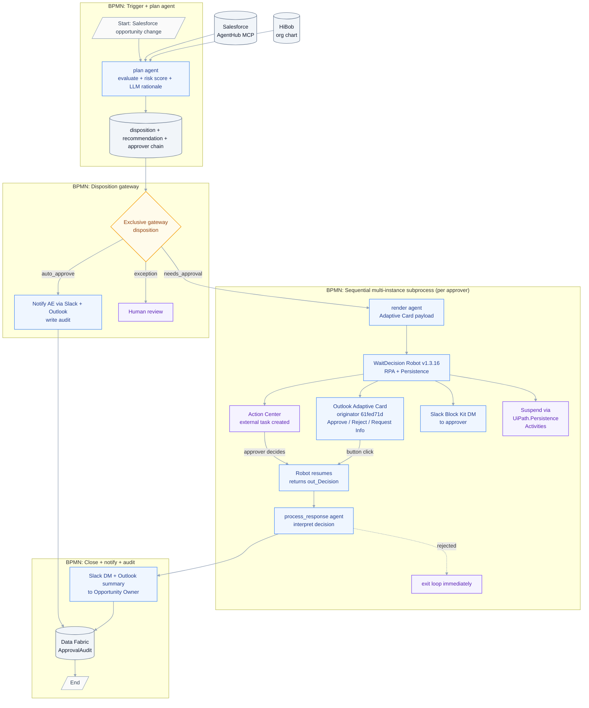
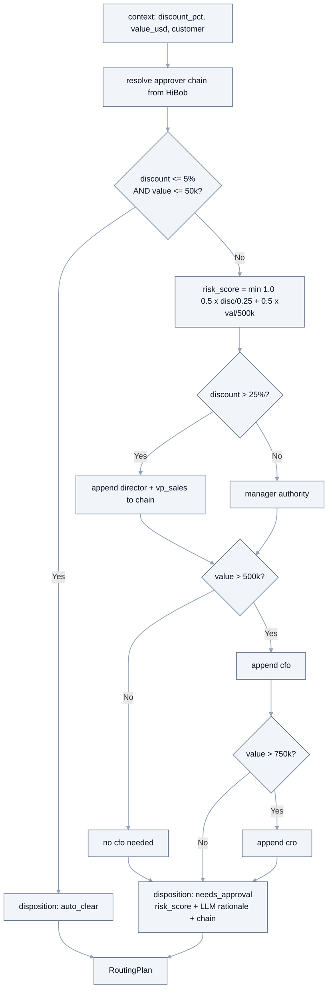

# Deal Desk Agent - Judging Mapping & Architecture (AgentHack 2026)

**Architecture accurate as of v1.2.3, June 22 2026.**
Key corrections vs. older versions: delivery = Outlook HTML email + AWS HITL portal (not Adaptive Card / Action Center); robot = WaitDecision UiPath Robot (not Azure Function); Salesforce = live IS + AgentHub MCP sidecar.

---

## 1. Fit against AgentHack 2026 criteria (Track 2: Maestro BPMN)

### Clean end-to-end BPMN 2.0 flow
Start → plan agent → disposition gateway → sequential multi-instance approver loop → process_response → notify → Data Fabric audit → End.
Every path is explicit. No dead ends. Short-circuit on rejection via `completionCondition`.

### Right actor at every step
| Step | Actor |
|---|---|
| Evaluate + draft recommendation | **plan agent** (LangGraph + LLM) |
| Build Adaptive Card payload | **render agent** (LangGraph) |
| Create Action Center task | **WaitDecision Robot** (`CreateExternalTask` — Deal Desk catalog) |
| Send Outlook Adaptive Card | **WaitDecision Robot** (IS Outlook connection, originator `61fed71d`) |
| Send Slack Block Kit DM | **WaitDecision Robot** (Slack Bot Token) |
| Suspend — wait for decision | **WaitDecision Robot** (`UiPath.Persistence.Activities`) |
| Decide (approve/reject/request info) | **Human approver** via Adaptive Card OR Action Center |
| Resume + return decision to BPMN | **WaitDecision Robot** (returns `out_Decision` directly) |
| Interpret collected decisions | **process_response agent** (LangGraph) |
| Record audit trail | **Data Fabric** |
| Notify requester | **Slack DM + Outlook summary** |

### Practical autonomy
- The agent **reasons** (risk score + LLM rationale), doesn't just apply rules.
- **Autonomous routing**: agent produces approver chain as a data structure; BPMN iterates it — routing depth is agent-decided, not hardcoded branches.
- `auto_clear` deals never touch a human — closed end to end autonomously.
- `process_response` interprets each collected decision and determines the next action.

### Runs on UiPath Automation Cloud (hard requirement)
Agent package `adaptive-approval-agent-core` v0.1.17 published, 3 entry points deployed as processes in `Shared/DealDeskApprovalGlobal`. BPMN v1.1.9, Robot v1.2.4, solution v1.2.3. All live on Automation Cloud.

### Human-in-the-loop governance — three channels
- **Channel 1: Outlook Adaptive Card** — real `application/adaptivecard+json` card embedded in email, originator `61fed71d-3b8c-4605-8f35-d95b70ab0803`. Approve/Reject/Request Info buttons (`Action.Http`). Rich HTML fallback table for non-supporting clients. Verified received live Jun 22 2026.
- **Channel 2: Action Center** — native external task in "Deal Desk" catalog. Approve/Reject/Request Info buttons in UiPath portal. Robot suspends via `UiPath.Persistence.Activities` — no BPMN polling loop. Verified working live Jun 22 2026.
- **Channel 3: Slack Block Kit** — DM to approver and requester with full deal data, recommendation, and link back to Outlook. Verified received live Jun 22 2026.
- **Rejection short-circuit**: BPMN `completionCondition` — chain ends immediately on first rejection.
- **Audit**: Data Fabric `ApprovalAudit` — ordered trail, agent recommendation vs. each human decision, timestamps.

### Real data integrations (live)
- **Salesforce**: live IS connection + AgentHub MCP sidecar (`Salesforce DealDesk MCP`) — `getSalesforceOpportunity`, `getSalesforceAccount`, `searchSalesforceSoql`.
- **Outlook**: live IS connection for HTML email delivery.
- **HiBob**: org chart mocked from `hibob_org.json` (production-ready design).

### Coding-agent bonus
Entire solution authored with **Cursor + Claude** via **UiPath for Coding Agents** (`uip` CLI + skills): LangGraph agent, BPMN, WaitDecision XAML, bindings, Salesforce MCP tools, Data Fabric entity. Directly earns the bonus and embodies the 2026 event theme.

---

## 2. Honest scope notes (for jury Q&A)

- **Salesforce**: live IS connection smoke-tested with real SOQL. Deal payload sourced from fixtures in the demo run (no live webhook yet).
- **HiBob**: org chart mocked from `agent/config/hibob_org.json` — architecture is production-ready.
- **AWS HITL portal**: external CloudFront bridge. Not a UiPath product — exists to give approvers a clean portal experience from email.

---

## 3. Architecture — accurate flow (v1.3.16 Robot / v1.1.9 BPMN)

---

## 4. Agent decision logic (`plan`)

---

## 5. Worked examples

| Input | Disposition | Chain | Approvers | Scenario |
|---|---|---|---|---|
| ≤5% / ≤$50k | auto_clear | none | 0 | No human touch. Closed in seconds. |
| 8% / $40k (`rpc_8pct.json`) | needs_approval | manager | 1 | Maya Stone (Manager) approves. |
| 30% / $1.2M (`rpc_30pct.json`) | needs_approval | manager→director→vp_sales→cfo | 4 | Full chain. Rejection short-circuits. |
| 30% / $900k | needs_approval | manager→director→vp_sales→cfo→cro | 5 | CRO added above $750k. |

---

## 6. Component map (deployed)

| Component | Type | Version | Key |
|---|---|---|---|
| `DealDeskApproval` | BPMN | 1.1.9 | `3533F569-7B5B-49A6-B0B9-087277D5D712` |
| `DealDeskApproval_WaitDecision` | RPA Robot | **1.3.16** | `0932CB58-FC8A-4287-AB2C-410E85075EBC` |
| `DealDeskAgent_plan` | AI Agent | 0.1.17 | `761D42AC-BEDD-4256-885F-E3C650C64018` |
| `DealDeskAgent_render` | AI Agent | 0.1.17 | `1C12455E-6E5A-4DE3-81FE-55654BA1D2E8` |
| `DealDeskAgent_process_response` | AI Agent | 0.1.17 | `99558773-C1CB-4F4B-994F-8DBB2EB242FD` |
| `Salesforce DealDesk MCP` | AgentHub MCP | 1.0.0 | `25641346-5f8a-46cf-91e3-6e862bd70cfb` |
| `DealDeskSolution` | Solution (.uipx) | 1.2.3 | deployed |
| AWS HITL Portal | External | — | `https://djun97l419cdy.cloudfront.net` |
| Folder | `Shared/DealDeskApprovalGlobal` | — | `5fc9fcc4-7156-40c2-9930-7ce61dbbf78b` |
